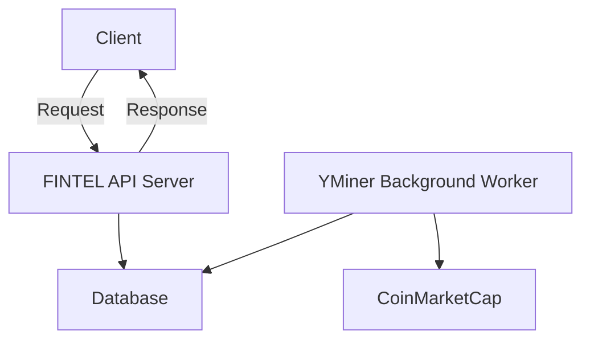

# Ynosis - Financial Intelligence API

Ynosis is a Flask API server and data miner designed to scrape, aggregate, and serve internet intelligence on cyber, crypto, and finance.



## Installation

Use the package manager [pip](https://pip.pypa.io/en/stable/) to install ynosis.

```bash
pip install -r requirements.txt
```

## Database Setup

Currently designed for postgres but with sqlalchemy can simply extend the ORM for your preferred database.

Setup a database.ini file inside your /db/ directory with the following format for ConfigParser

```bash
[gds]
database=DB_NAME
password=DB_PASSWORD
host=DB_HOST
user=DB_USER
jdbc=JDBC_STRING
```

Setup Redis config in .env - see .env.example
```bash
REDIS_HOST=your_redis_host
REDIS_PORT=your_redis_port
REDIS_DB=your_redis_db
```

## Yminer Setup

Only Coinmarketcap mining operational

Setup a yminer.ini file insider your /yminer/ directory with the following format for ConfigParser
```bash
[cmc]
key=
```
## Unix / Linux Usage

```bash
bash bootstrap.sh
```

## TODO: Docker Usage

Ensure docker is installed on your machine and run the following command in your working directory. 

```bash
docker build -t ynosis/v1 .

```

## Contributing

Pull requests are welcome. For major changes, please open an issue first
to discuss what you would like to change.

Please make sure to update tests as appropriate.

## License

[MIT](https://choosealicense.com/licenses/mit/)